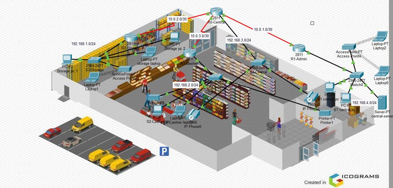

# Smart Mini-Market Network

> A Cisco Packet Tracer network design created to connect the main departments of a smart mini-market through a reliable and organized network infrastructure.

## Project Overview

This project was developed to address common challenges in traditional mini-markets, such as slow checkout processes, limited communication between departments, and difficulty managing inventory and services in one connected system.

The network design connects the Storage, Cashier, Central, and Administration departments to support smooth communication and data sharing across the mini-market.

## Network Design

The project was designed in Cisco Packet Tracer using multiple department-based LANs connected through routers.

The network includes:

- Routers and switches for communication between departments
- A central server for network services
- PCs and laptops for daily operations
- IP phones for VoIP communication
- Printers for cashier and central-area use
- Wireless access points for Wi-Fi connectivity
- DHCP for automatic IP address assignment
- DNS and server-based network services
- WPA2-PSK protection for wireless access

## Main Features

- Connects different mini-market departments through a structured network
- Supports communication between Storage, Cashier, Central, and Admin areas
- Provides automatic IP address assignment using DHCP
- Uses a central server to support network services
- Includes wired and wireless devices
- Supports VoIP communication through IP phones
- Allows printers and workstations to communicate across the network
- Connectivity was tested between departments and the central server using ping

## My Contribution

My role in the project focused on configuring the main router.

I assigned IP addresses to router interfaces, connected the departments to the router, configured default gateways, and added routing so that the LANs could communicate with each other. I also tested the network using ping to confirm that the connections were working properly.

## Tools Used

- Cisco Packet Tracer
- Networking Fundamentals
- IP Addressing
- Routing
- DHCP
- DNS
- VoIP
- Wireless Network Configuration

## Topology Overview

## Project Type

Group project developed as part of a Computer Science networking course.

> The original Packet Tracer file and full project documentation are kept private.
